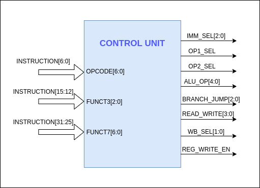

# Control Unit

---

The‌ ‌control‌ ‌unit‌ ‌generates‌ ‌the ‌‌necessary‌ ‌control‌ ‌signals ‌‌to‌‌ select‌‌ the‌‌ proper‌ ‌data‌ ‌path‌ ‌for‌ ‌the‌ ‌instruction.‌

Inputs‌ ‌to‌ ‌the‌ ‌control‌ ‌unit‌ ‌are,

- OPCODE[6:0]
- FUNCT3[2:0]
- FUCNT7[6:0]

Outputs‌ ‌generated‌ ‌from‌ ‌the‌ ‌control‌‌ unit‌ ‌are,‌ ‌

- IMM_SEL[2:0]‌ ‌
- OP1_SEL‌ ‌
- OP2_SEL‌ ‌
- ALU_OP[4:0]‌
- BRANCH_JUMP[2:0]‌ ‌
- MEM_WRITE‌ ‌
- MEM_READ‌ ‌
- WB_SEL[1:0]‌ ‌
- REG_WRITE_EN
