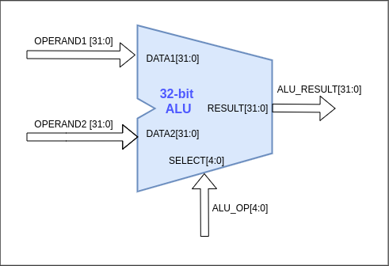

# ALU

ALU is the main hardware unit that performs arithmetic and logic operations. This ALU supports 18 operations.

- ADD
- SUB
- SLL
- SLT
- SLTU
- XOR
- SRL
- SRA
- OR
- AND
- MUL
- MULH
- MULHU
- MULHSU
- DIV
- DIVU
- REM
- REMU

Inputs to the ALU are,

- DATA1[31:0]
- DATA2[31:0]
- ALU_OP[4:0]

Output of the ALU,

- ALU_RESULT[31:0]
