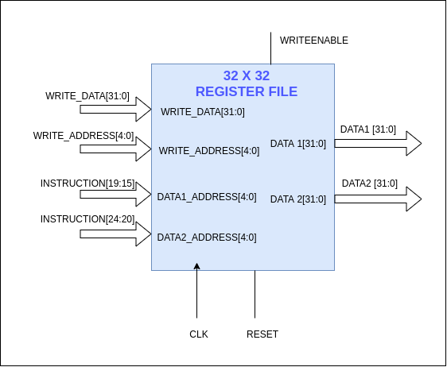

# Register File

Register file contains 32 registers and the size of a register is 32 bits. Register x0 is set to zero by making all the bits in register x0 to 0. Registers x1 to x31 can be used by the instructions.
In RISC-V ISA NOP instruction is encoded as an ADDI instruction. In this case the register x0 containing the value zero will be used.

`NOP ⇒ ADDI x0, x0, 0`

Inputs to the register file,

- WRITE_DATA[31:0]
- WRITE_ADDRESS[4:0]
- DATA1_ADDRESS[4:0]
- DATA2_ADDRESS[4:0]
- REG_WRITE_EN control signal
- RESET
- CLK

Outputs of the register file,

- DATA1[31:0]
- DATA2[31:0]
