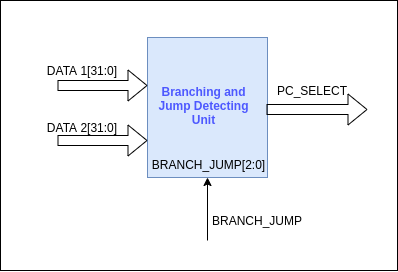
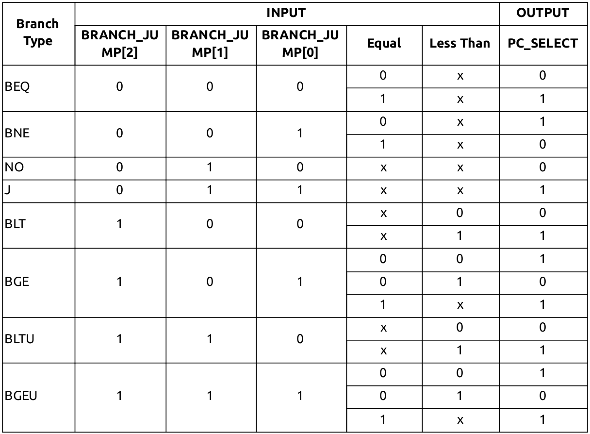
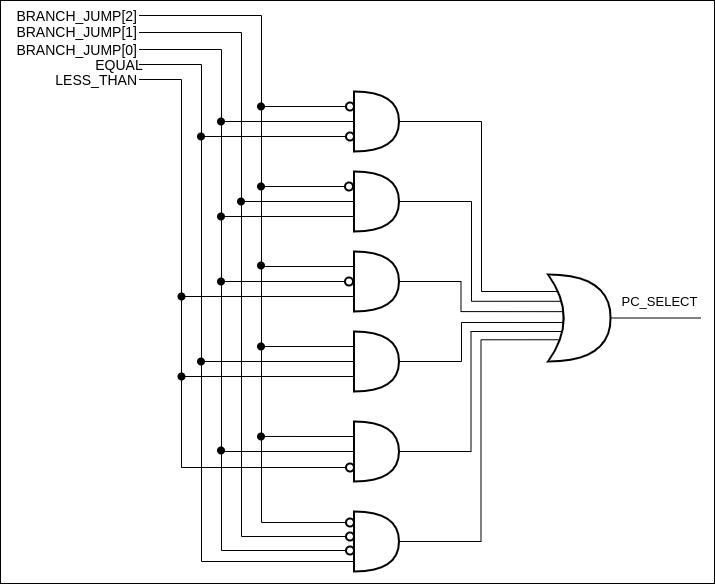

# Branch and Jump Detection Unit

This unit is for detecting whether the branch or the jump has to be taken or not. Inputs to this unit are,

- DATA1[31:0]
- DATA2[31:0]
- BRANCH_JUMP[2:0] control signal (See [BRANCH_JUMP](#branch_jump) for encoding)

Output of this unit is,

- PC_SELECT

This unit will contain a comparator implemented using behavioural modeling and a combinational logic circuit to generate the PC_SELECT control signal. Branch and jump detection is done in 2 steps.

1. DATA1 and DATA2 values will be the inputs for the comparator. The comparator will output two 1 bit signals by comparing the input values,

   - EQUAL - If DATA1 and DATA2 are equal this signal will be set. Else it will be cleared.
   - LESS_THAN - If DATA1 is less than DATA2 this signal will be set. Else it will be cleared.

2. BRANCH_JUMP control signal, EQUAL and LESS_THAN intermediate signals will be the inputs to the combinational logic circuit. The combinational logic circuit will generate the PC_SELECT control signal depending on its inputs.

#### PC_SELECT Control Signal

PC_SELECT is a 1 bit control signal generated from the branch and jump detection unit. This signal will select the address source for the PC register. The PC register has 2 address sources.

- Address computed by the ALU
- Address computed by adding 4 to the current PC

| Address Source            | PC_SELECT |
| ------------------------- | --------- |
| PC + 4                    | 0         |
| Computer address from ALU | 1         |
