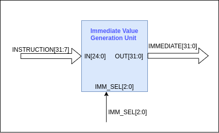
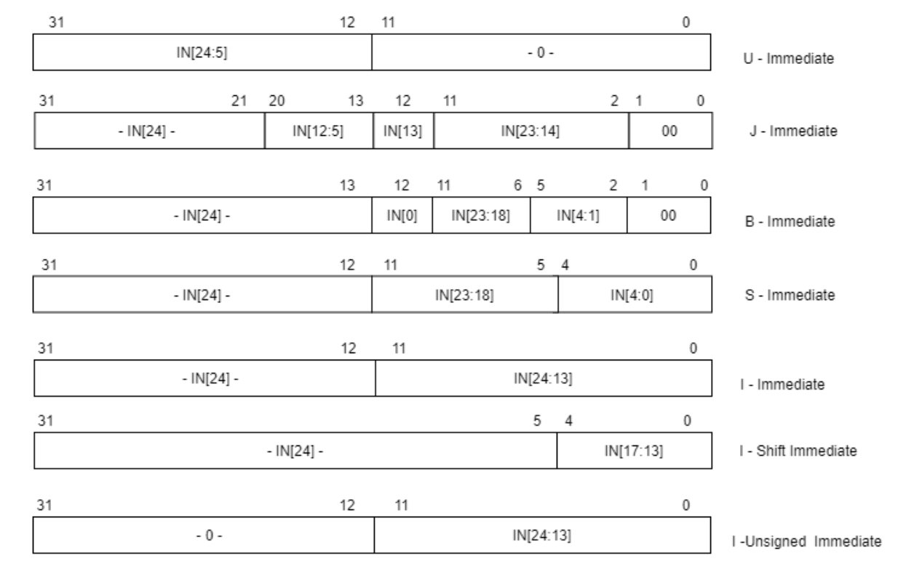

# Immediate Value Generation Unit

Instructions ‌‌with‌‌ immediate‌‌ values‌‌ can‌‌ be‌‌ categorized‌‌ into‌‌ 4‌‌ groups‌‌ and‌‌ I-Type‌‌ instructions‌‌ can‌‌ be‌‌ further‌ ‌categorized‌ ‌into‌ ‌3‌ ‌sub‌ ‌groups.‌

- U‌ ‌type‌ ‌Immediate‌ ‌
- J‌ ‌type‌ ‌Immediate‌‌ ‌
- S‌ ‌type‌ ‌Immediate‌ ‌
- B‌ ‌type‌ ‌Immediate‌ ‌
- I‌ ‌type‌ ‌Immediate‌ ‌with‌ ‌signed‌ ‌Extension‌ ‌(Extend‌ ‌with‌ ‌sign‌ ‌bit)‌ ‌
- I‌ ‌type‌ ‌immediate‌ ‌containing‌ ‌shift‌ ‌amount‌ ‌
- I‌ ‌type‌ ‌immediate‌ ‌with‌ ‌unsigned‌ ‌Extension‌ ‌(Extend‌ ‌with‌ ‌Zero)

Inputs‌ ‌to‌ ‌the‌ ‌immediate‌ ‌value‌ ‌generation‌ ‌unit‌ ‌are,‌ ‌

- INSTRUCTION[31:7]‌ ‌
- IMM_SEL‌ ‌control‌ ‌signal[2:0]‌

Output‌ ‌of‌ ‌the‌ ‌immediate‌ ‌value‌ ‌generation‌ ‌unit‌ ‌is,‌ ‌

- IMMEDIATE_VALUE[31:0]

Immediate ‌‌value‌‌ generation‌‌ unit‌‌ will‌‌ generate‌‌ the‌‌ immediate‌‌ values‌‌ and‌‌ sign‌‌ extends‌‌ by‌‌ rerouting‌‌ the‌ ‌wires.‌ ‌Depending‌ ‌on‌ ‌the‌ ‌IMM_SEL‌ ‌control‌ ‌signal,‌ ‌this‌ ‌unit‌ ‌will‌ ‌output‌ ‌the‌ ‌proper‌ ‌immediate‌‌ value.‌ ‌Immediate‌ ‌value‌ generation‌‌ and‌‌ sign‌‌ extending‌‌ of‌‌ the‌‌ 7‌‌ categories‌‌ are‌‌ shown‌‌ in‌‌ the‌‌ figure ‌‌below.‌

