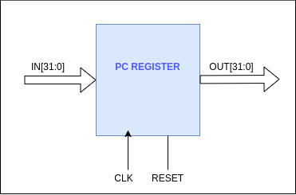

# Program Counter Register

Program counter register stores the address of the instruction. The value stored in this register is used when fetching the instruction from the instruction memory. Writing to the PC register is synchronous to the positive clock edge and the reading from the PC register is asynchronous. When the reset signal is set, the value in the PC register will be set to -4 and the program will restart from the next clock cycle.

