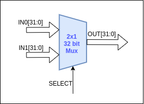
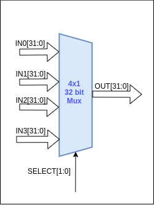

# Multiplexers

Three 2x1 and one 4x1 multiplexers are used in the design. Depending on the select signal, the multiplexer will output the corresponding value.

|                                                          | Type of MUX | Inputs‌ ‌from‌ ‌                                                                           | Select‌ ‌signal‌ ‌           | Output‌ ‌to                                       |
| -------------------------------------------------------- | ----------- | ------------------------------------------------------------------------------------------ | ---------------------------- | ------------------------------------------------- |
| Selecting‌ ‌the‌‌ address‌ ‌source‌‌ for‌ ‌PC‌ ‌register | 2x1‌ ‌MUX   | PC+4,Address‌‌ computer‌ ‌by‌ ‌the‌‌ ALU                                                   | PC_SELECT‌‌ control‌ signal‌ | PC‌ ‌register                                     |
| Selecting the operand‌ ‌1‌ ‌for‌ ‌the‌‌ ALU              | 2x1‌ ‌MUX   | DATA1‌ ‌from‌‌ register‌ ‌file,‌ ‌ PC‌ ‌value                                              | OP1_SEL                      | DATA1‌ ‌input‌ ‌of‌‌the‌ ‌ALU                     |
| Selecting the operand‌ ‌2 ‌for‌ ‌the‌‌ ALU               | 2x1‌ ‌MUX   | DATA2 ‌from‌‌ register‌ ‌file,‌ ‌ PC‌ ‌value                                               | OP2_SEL                      | DATA1‌ ‌input‌ ‌of‌‌the‌ ‌ALU                     |
| Selecting the operand‌ ‌1‌ ‌for‌ ‌the‌‌ ALU              | 2x1‌ ‌MUX   | DATA1‌ ‌from‌‌ register‌ ‌file,‌ ‌ PC‌ ‌value                                              | OP1_SEL                      | DATA2 ‌input‌ ‌of‌‌the‌ ‌ALU                      |
| Selecting the writeback‌ ‌source                         | 4x1‌ ‌MUX   | ALU result, PC‌ ‌+‌ ‌4‌ ‌value,‌ ‌Immediate‌ ‌value,‌ ‌Read‌ ‌data‌ ‌from‌‌ data‌ ‌memory‌ | WB_SEL‌                      | Write‌ ‌data‌ ‌input‌‌ of‌ ‌the‌ ‌register‌‌ file |
