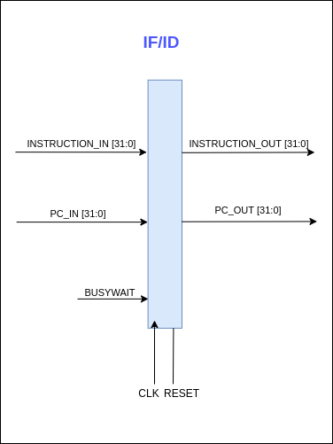
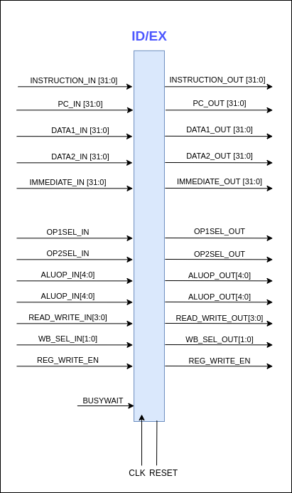
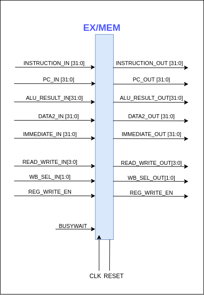
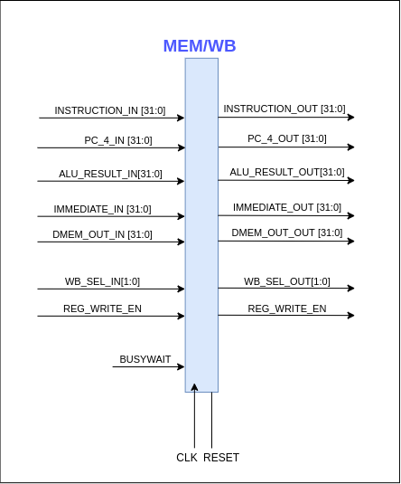

# Pipeline Register

---

In‌ ‌CPU‌ ‌pipelines,‌ ‌pipeline‌ ‌registers‌ ‌are‌ ‌used‌ ‌to‌ ‌store‌ ‌the‌ ‌information‌ ‌and‌ ‌control‌ ‌signals‌ ‌related‌ ‌to‌‌ the‌ ‌instruction.‌ ‌In‌ ‌this‌ ‌CPU‌ ‌design‌ ‌there‌ ‌are‌ ‌5‌ ‌stages,‌ ‌

- Instruction‌ ‌Fetch‌ ‌stage‌ ‌
- Instruction‌ ‌Decode‌ ‌stage‌ ‌
- Execution‌ ‌stage‌ ‌
- Memory‌ ‌Access‌ ‌stage‌ ‌
- Writeback‌ ‌stage‌

In‌ ‌between‌ ‌each‌ ‌stage‌ ‌there‌ ‌is‌ ‌a‌ ‌pipeline‌ ‌register.‌‌ ‌

- IF/ID‌ ‌pipeline‌ ‌register‌ ‌
- ID/EX‌ ‌pipeline‌ ‌register‌ ‌
- EX/MEM‌ ‌pipeline‌ ‌register‌ ‌
- MEM/WB‌ ‌pipeline‌ ‌register‌

Data‌ ‌and‌ ‌control‌ ‌signals‌ ‌are‌ ‌written‌ ‌to‌ ‌the‌ ‌pipeline‌ ‌registers‌ ‌at‌ ‌the‌ ‌positive‌ ‌edge‌ ‌of‌ ‌the‌ ‌clock‌ ‌cycle‌‌ and‌ ‌when‌ ‌the‌ ‌reset‌ ‌signal‌ ‌is‌ ‌set,‌ ‌the‌ ‌pipeline‌ ‌registers‌ ‌will‌ ‌get‌ ‌reset.

