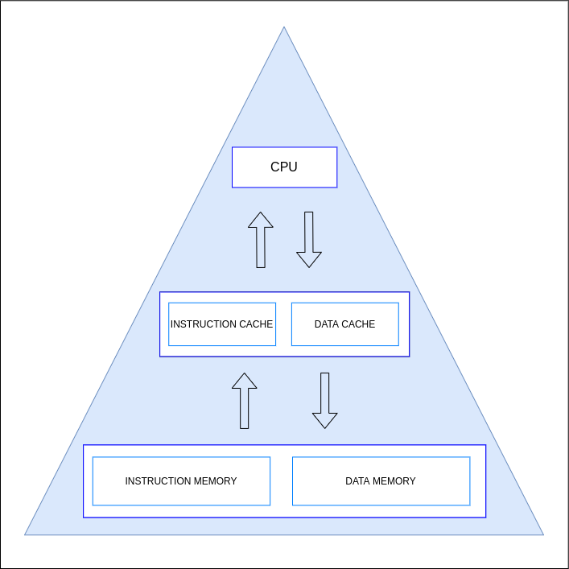

# Memory Hierarchy

---

Memory‌ ‌is‌ ‌organized‌ ‌into‌ ‌a‌ ‌hierarchy‌ ‌so‌ ‌that‌ ‌from‌ ‌the‌ ‌point‌ ‌of‌ ‌view‌ ‌of‌ ‌the‌ ‌CPU‌ ‌it‌ ‌will‌ ‌have‌ ‌a‌ ‌large‌‌
and‌ ‌fast‌ ‌memory.‌ ‌The‌ ‌CPU‌ ‌directly‌ ‌communicates‌ ‌with‌ ‌the‌ ‌caches‌ ‌which‌ ‌are‌ ‌faster‌ ‌than‌ ‌the‌ ‌primary‌‌
memory‌ ‌and‌ ‌smaller‌ ‌in‌ ‌capacity.‌ ‌Memory‌ ‌is‌ ‌organized‌ ‌as‌ ‌shown‌ ‌in‌ ‌the‌ ‌following‌ ‌figure‌ ‌and‌ ‌it‌‌
consists‌ ‌of,‌

- A‌ ‌data‌ ‌cache
- An‌ ‌instruction‌ ‌cache‌ ‌
- A‌ ‌data‌ ‌memory‌ ‌
- An‌ ‌instruction‌ ‌cache‌

