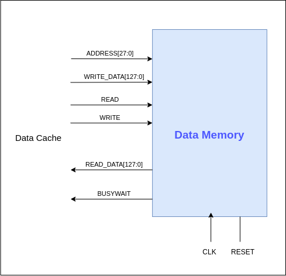
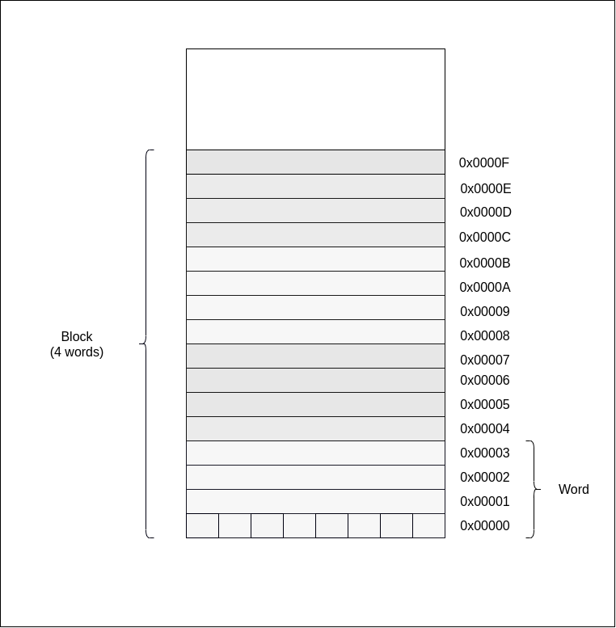

# Data Memory

---

Inputs‌ ‌to‌ ‌Data‌ ‌Memory‌ ‌from‌ ‌Data‌ ‌Cache‌ ‌are,‌ ‌

- ADDRESS[27:0]‌ ‌
- WRITE_DATA[127:0]‌ ‌
- READ‌ ‌
- WRITE‌ ‌

Outputs‌ ‌from‌ ‌Data‌ ‌Cache‌ ‌to‌ ‌CPU‌ ‌are,‌ ‌

- READ_DATA[127:0]‌ ‌
- BUSYWAIT‌ ‌

