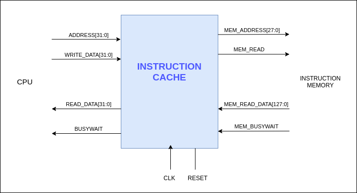
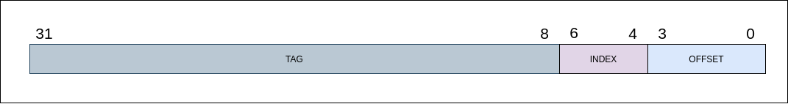
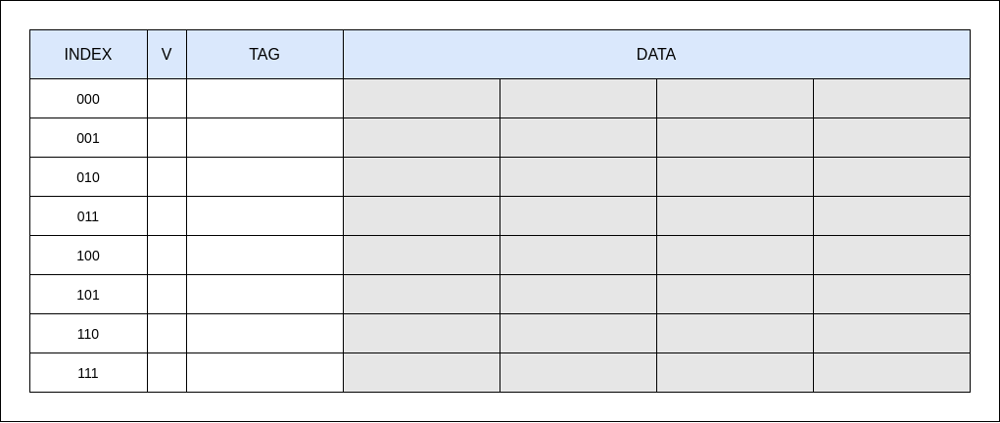
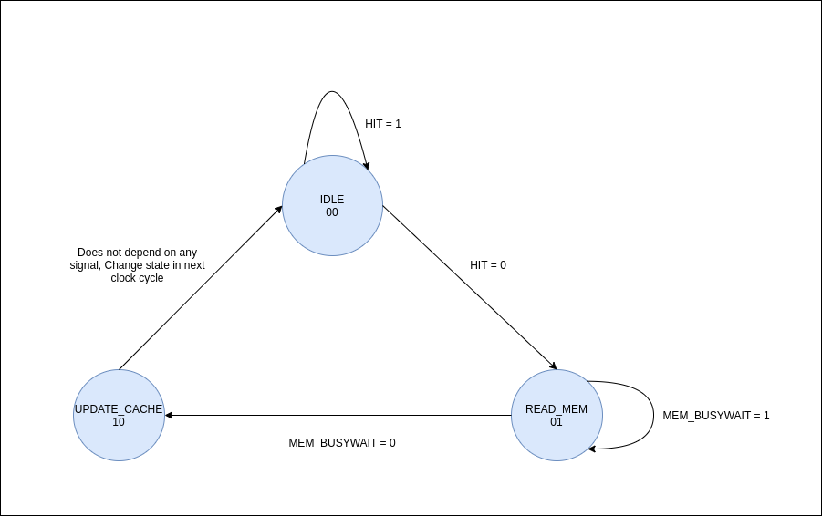

# Instruction Cache

---

Instruction‌ ‌cache‌ ‌operation‌ ‌is‌ ‌similar‌ ‌to‌‌ the‌ ‌data‌ ‌cache‌ ‌and‌ ‌the‌ ‌only‌‌difference‌‌is‌‌ that‌ ‌it‌ ‌does‌ ‌not‌ ‌undergo‌ ‌writing.‌‌ ‌
‌

Inputs‌ ‌to‌ ‌Instruction‌ ‌Cache‌ ‌from‌ ‌CPU‌ ‌are,‌ ‌

- ADDRESS[31:0]‌ ‌
- WRITE_DATA[31:0]‌ ‌

Outputs‌ ‌from‌ ‌Instruction‌ ‌Cache‌ ‌to‌ ‌CPU‌‌ are,‌ ‌

- READ_DATA[31:0]‌ ‌
- BUSYWAIT‌

Inputs‌ ‌to‌ ‌Instruction‌ ‌Cache‌ ‌from‌ ‌Instruction‌ ‌Memory‌ ‌are,‌ ‌

- MEM_READ_DATA[127:0]‌ ‌
- MEM_BUSYWAIT‌ ‌

Outputs‌ ‌from‌ ‌Data‌ ‌Cache‌ ‌to‌ ‌Data‌ ‌Memory‌ ‌are,‌ ‌

- MEM_ADDRESS[27:0]‌ ‌
- MEM_READ‌

When‌‌ considering‌‌ the‌‌ structure‌‌ of‌‌ the‌‌ instruction‌‌ cache,‌it‌‌ is‌‌ also‌‌ implemented‌‌ as‌‌ a‌‌ direct‌‌ mapped‌‌ cache. ‌‌A‌‌ cache‌‌ block‌‌ contains‌‌ 16‌‌ bytes‌‌ of‌‌ data‌‌ and‌‌ has‌‌ 8‌‌ blocks.‌This‌‌ cache‌‌ structure‌‌ can‌‌ store‌‌ 128‌‌ bytes‌ ‌of‌ ‌data.‌

The‌ ‌input‌ ‌ADDRESS‌ ‌is‌ ‌separated‌ ‌into‌ ‌TAG,‌ ‌INDEX‌ ‌and‌ OFFSET‌ ‌as‌ ‌the‌ ‌following‌ ‌figure.

Similar‌ ‌to‌ ‌the‌ ‌data‌ ‌cache,‌ ‌instruction‌ ‌cache‌ ‌controller‌ ‌is‌ also‌ ‌implemented‌ ‌using‌ ‌a‌ ‌finite‌ ‌state‌‌ machine.‌‌ In‌‌ this‌‌ state‌‌ machine,‌ there‌‌ is‌‌ no‌‌ memory‌‌ writing‌‌ stage‌‌ since‌‌ instructions‌‌ are‌‌ not‌‌ written‌‌ to‌ ‌the‌ ‌memory.

The‌ ‌state‌ ‌diagram‌ ‌is‌ ‌shown‌ ‌in‌ ‌the‌ ‌following‌ ‌figure.‌

