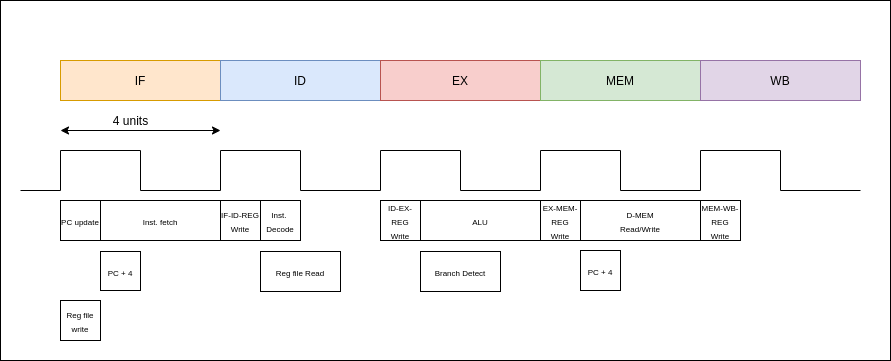

# Clock‌ ‌Cycle‌ ‌Period‌ ‌and‌ ‌Overall‌ ‌Delays‌ ‌on‌ ‌the‌ ‌Pipeline‌‌ Stages

---

Instruction‌ ‌fetch‌ ‌stage,‌ ‌execution‌ ‌stage‌ ‌and‌ ‌the‌ ‌memory‌ ‌access‌ ‌stage‌ ‌consumes‌ ‌the‌ ‌most‌ ‌number‌‌ of‌ ‌time‌ ‌units‌ ‌and‌ ‌it‌ ‌is‌ ‌4‌ ‌time‌ ‌units.‌ ‌Therefore‌ ‌the‌ ‌clock‌ ‌cycle‌ ‌period‌ ‌was‌ ‌taken‌ ‌as‌ ‌4‌ time‌ ‌units‌ ‌so‌‌ that‌ ‌each‌ ‌and‌ ‌every‌ ‌stage‌ ‌will‌ ‌complete‌ ‌within‌ ‌a‌ ‌clock‌ ‌cycle.‌

