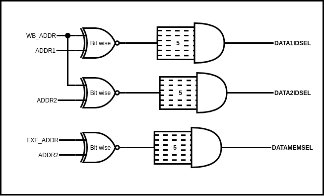

# Forwarding‌ ‌unit‌ ‌Hardware

---

Forwarding‌ ‌unit‌ ‌is‌ ‌used‌ ‌to‌ ‌detect‌‌the‌ ‌Hazard‌ ‌and‌ ‌generate‌‌ necessary‌ ‌control‌ ‌signals‌ ‌for‌ ‌an‌‌ instruction‌ ‌during‌ ‌the‌ ‌instruction‌‌ decode‌ ‌stage.

Inputs‌ ‌to‌ ‌the‌ ‌Forwarding‌ ‌Unit‌ ‌are,‌ ‌

- OPCODE[6:0]‌‌ ‌:‌ ‌Opcode‌ ‌from‌ ‌Current‌ ‌Instruction‌ ‌
- ADDR1[4:0]‌‌ ‌:‌ ‌Register‌ ‌Read‌ ‌Address‌ ‌1‌ ‌from‌ ‌Current‌ ‌Instruction‌ ‌
- ADDR2[4:0‌ ]‌ ‌:‌ ‌Register‌ ‌Read‌ ‌Address‌ ‌2‌ ‌from‌ ‌Current‌ ‌Instruction‌ ‌
- OP1SEL‌‌ ‌:‌ ‌Generates‌ ‌from‌ ‌Control‌ ‌Unit‌ ‌
- OP2SEL‌‌ ‌:‌ ‌Generates‌ ‌from‌ ‌Control‌ ‌Unit‌ ‌
- WB_ADDR[4:0]‌‌ ‌:‌ ‌Register‌ ‌Write‌ ‌Address‌ ‌from‌ ‌WriteBack‌ ‌Stage‌ ‌
- MEM_ADDR[4:0]‌‌ ‌:‌ ‌Register‌ ‌Write‌ ‌Address‌ ‌from‌ ‌Memory‌ ‌Stage‌ ‌
- EXE_ADDR[4:0]‌‌ ‌:‌ ‌Register‌ ‌Write‌ ‌Address‌ ‌from‌ ‌Execute‌ ‌Stage‌

Outputs‌ ‌generated‌ ‌from‌ ‌the‌ ‌forwarding‌ ‌unit‌ ‌are,‌ ‌
‌

- DATA1IDSEL‌‌ ‌:‌ ‌Signal‌ ‌for‌ ‌Data1‌ ‌selection‌ ‌Multiplexer‌ ‌in‌ ‌instruction‌ ‌decode‌ ‌stage‌ ‌
- DATA2IDSEL‌‌ ‌:‌ ‌Signal‌ ‌for‌ ‌Data2‌ ‌selection‌ ‌Multiplexer‌ ‌in‌ ‌instruction‌ ‌decode‌ ‌stage‌ ‌
- DATA1ALUSEL‌ ‌[1:0]‌‌ ‌:‌ ‌Signal‌ ‌for‌ ‌ALU‌ ‌Data1‌ ‌input‌ ‌selection‌ ‌Multiplexer‌ ‌in‌ ‌EXE‌ ‌stage‌ ‌
- DATA2ALUSEL[1:0]‌ : ‌ ‌ ‌Signal‌ ‌for‌ ‌ALU‌ ‌Data2‌ ‌input‌ ‌selection‌ ‌Multiplexer‌ ‌in‌ ‌EXE‌ ‌stage‌ ‌
- DATA1BJSEL‌ ‌[1:0]‌‌ ‌:‌ ‌Signal‌ ‌for‌ ‌Branch‌ ‌Logic‌ ‌Data1‌ ‌input‌ ‌selection‌ ‌Multiplexer‌ ‌in‌ ‌EXE‌ ‌stage‌ ‌
- DATA2BJSEL[1:0]‌ : ‌ ‌ ‌Signal‌ ‌for‌ ‌Branch‌ ‌Logic‌ ‌Data2‌ ‌input‌ ‌selection‌ ‌Multiplexer‌ ‌in‌ ‌EXE‌ ‌stage‌ ‌
- DATAMEMSEL‌ : ‌ ‌ ‌Signal‌ ‌for‌ ‌Memory‌ ‌In‌ ‌Data‌ ‌selection‌ ‌Multiplexer‌ ‌in‌ ‌Memory‌ ‌Stage

Following ‌‌diagrams‌‌ show‌‌ the‌‌ combinational‌‌ logic‌‌ used‌‌ for‌‌ detecting‌‌ a‌‌ data‌‌ hazard‌‌ and‌‌ generating‌‌ the‌‌ relevant‌‌ control‌‌ signals‌‌ inside‌‌ the‌‌ forwarding‌‌ unit.‌‌ Combinational‌‌ logic‌‌ will‌‌ detect‌‌ the‌‌ hazards‌‌ at‌ ‌the‌ ‌decode‌ ‌stage‌ ‌by‌ ‌comparing‌ ‌the‌ ‌register‌ ‌read‌ ‌addresses‌ ‌at‌ ‌the‌ ‌decode‌ ‌stage‌ ‌with‌ ‌the‌‌ writeback‌‌ registers‌‌ of‌‌ instructions‌‌ at‌‌ the‌‌ execution‌‌ stage,‌‌ memory‌‌ stage‌‌ and‌‌ the‌‌ writeback‌‌ stage.‌‌
OPCODE‌ ‌control‌ ‌signals‌ ‌were‌ ‌also‌ ‌used‌ ‌when‌ ‌determining‌ ‌the‌ ‌control‌ ‌signal‌ ‌for‌ ‌the‌ ‌forwarding‌‌ multipliers.‌ ‌2x1‌ ‌Multiplexers‌ ‌before‌ ‌the‌ ‌ALU‌ ‌in‌ ‌the‌ ‌basic‌ ‌pipeline‌ ‌without‌ ‌forwarding‌ ‌were‌‌ replaced‌ ‌with‌ ‌4x1‌ ‌Multiplexers‌ ‌and‌ ‌OP1SEL‌ ‌and‌ ‌OP2SEL‌ ‌signals‌ ‌were‌ ‌used‌ ‌when‌ ‌generating‌ ‌the‌‌ necessary‌ ‌control‌ ‌signals‌ ‌for‌ ‌the‌ ‌multiplexers.‌

‌
