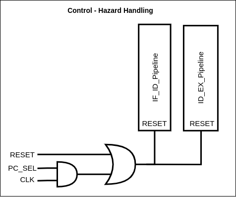

# Handling Control Hazards

---

Control‌ ‌hazards‌‌ were‌‌ handled‌‌ by‌‌ flushing‌‌ the‌‌ IF/ID‌‌ and‌‌ ID/EX‌‌ pipeline‌‌ register‌‌s when‌‌ the‌‌ branch‌‌ is‌‌ taken‌ ‌or‌ ‌in‌ ‌the‌ ‌case‌ ‌of‌ ‌a‌ ‌jump‌ ‌so‌ ‌that‌ ‌the‌ ‌incorrect‌ ‌instructions‌ ‌fetched‌ ‌and‌ ‌decoded‌ ‌will‌ ‌be‌‌discarded.‌ ‌Following‌ ‌combinational‌ ‌logic‌ ‌was‌ ‌used‌ ‌to‌ ‌implement‌ ‌the‌ ‌flushing‌ ‌mechanism.‌‌ ‌
In ‌‌the‌‌ case‌‌ of‌‌ a‌‌ taken‌‌ branch‌‌ or‌‌ jump‌‌, the‌‌ PC_SEL‌‌ control‌‌ signal‌‌ will‌‌ be‌‌ set‌‌ and‌‌ this‌‌ signal‌‌ along‌‌ with‌‌ the‌ ‌CLK‌ ‌signal‌ ‌is‌ ‌connected‌ ‌to‌ ‌the‌ ‌RESET‌ ‌port‌ ‌of‌ ‌the‌ ‌IF/ID‌ ‌and‌ ‌ID/EX‌ ‌pipeline‌ ‌register.

