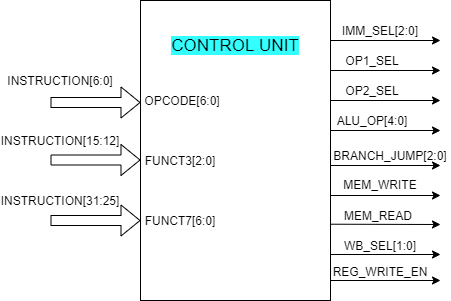
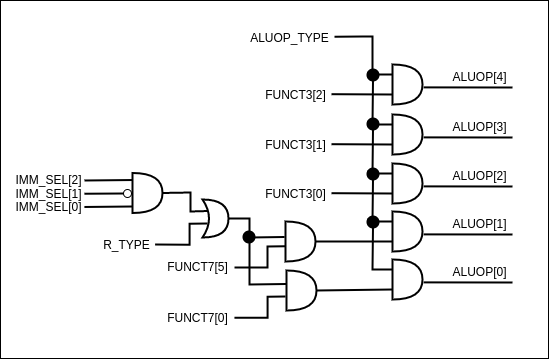
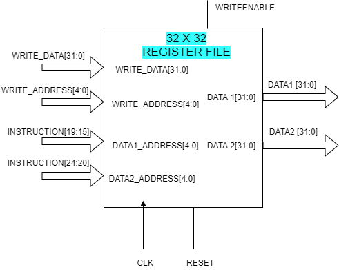
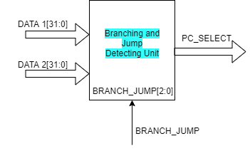
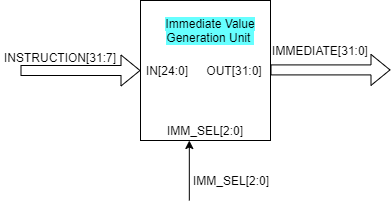

[comment]: # "This is the standard layout for the project, but you can clean this and use your own template"

# RV32IM Pipeline Implementation

---

This is a sample image, to show how to add images to your page. To learn more options, please refer [this](https://projects.ce.pdn.ac.lk/docs/faq/how-to-add-an-image/)

---

## Table of Contents

1. [Introduction](#introduction)
2. [Pipeline Datapath](#pipeline-datapath)
3. [Hardware Units](#hardware-units)
   - [Control Unit](#control-unit)
     - [Control Signals Generated by the Control Unit](#control-signals-generated-by-the-control-unit)
     - [Control‌ ‌Unit‌ ‌Design‌](#control-unit-design)
     - [Instructions‌ ‌and‌ ‌the‌ ‌Control‌ ‌Signals](#instructions-and-the-control-signals)
   - [ALU](#alu)
   - [Register File](#register-file)
   - [Branch and Jump Detection Unit](#branch-and-jump-detection-unit)
   - [Immediate Value Generation Unit](#immediate-value-generation-unit)
   - [Program Counter Register](#program-counter-register)
   - [Multiplexers](#multiplexers)
   - [Program Counter Incrimenting Adder](#program-counter-incrimenting-adder)
4. [Team](#team)
5. [Supervisors](#supervisors)
6. [Links](#links)

---

## Introduction

description of the real world problem and solution, impact

---

## Pipeline Datapath

---

## Hardware Units

### Control Unit

The‌ ‌control‌ ‌unit‌ ‌generates‌ ‌the ‌‌necessary‌ ‌control‌ ‌signals ‌‌to‌‌ select‌‌ the‌‌ proper‌ ‌data‌ ‌path‌ ‌for‌ ‌the‌ ‌instruction.‌

Inputs‌ ‌to‌ ‌the‌ ‌control‌ ‌unit‌ ‌are,

- OPCODE[6:0]
- FUNCT3[2:0]
- FUCNT7[6:0]

Outputs‌ ‌generated‌ ‌from‌ ‌the‌ ‌control‌‌ unit‌ ‌are,‌ ‌

- IMM_SEL[2:0]‌ ‌
- OP1_SEL‌ ‌
- OP2_SEL‌ ‌
- ALU_OP[4:0]‌
- BRANCH_JUMP[2:0]‌ ‌
- MEM_WRITE‌ ‌
- MEM_READ‌ ‌
- WB_SEL[1:0]‌ ‌
- REG_WRITE_EN

#### Control Signals Generated by the Control Unit

##### IMM_SEL

This control signal is for the immediate value generation unit. In RISC-V ISA, according to the ordering of the immediate value bits there are 7 variants (See Immediate value generation unit for more details).

- U - Type
- J - Type
- S - Type
- B - Type
- I - Type signed
- I - Type containing shift amount
- I - Type unsigned

The immediate value generation unit will generate these 7 types of immediate values and the IMM_SEL control signal will select the relevant immediate value. The IMM_SEL control signal is a 3-bit signal and the encoding of the bits are as shown in Table 1.

##### OP1_SEL

The input operand 1 of the ALU unit is of 2 values.

- PC value - For AUIPC, JAL, B - Type instructions
- DATA1 (value from the register file) - For all the other remaining instructions

This control signal will select between these two values. This is a 1 - bit control signal and the encoding is shown in Table 2.

##### OP2_sel

The input operand 2 of the ALU unit is of 2 values.

- DATA2 (value from the register file) - For R - Type instructions
- Immediate value - For all the other remaining instructions

This control signal will select between these two values. This is a 1 - bit control signal and the encoding is shown in Table 3.

##### ALU_OP

This signal will select the relevant ALU operation out of the 18 ALU operations . This is a 5 - bit control signal and the encoding is shown in Table 4.

##### BRANCH_JUMP

This control signal will select the type of branching to be considered by the Branching and Jump detection unit. Instructions in RV32IM can be categorized into 8 categories depending on their branching (See Branching and Jump Detection Unit for more details).

- BEQ - For BEQ instruction
- BNE - For BNE instruction
- J - For J - Type instruction
- BLT - For BLT instruction
- BGE - For BGE instruction
- BLTU - For BLTU instruction
- BGEU - For BGEU instruction
- NO - For all other remaining instructions

BRANCH_JUMP control signal is a 3 - bit control signal and encoding is shown in Table 5.

##### MEM_WRITE

This control signal will enable writing to the data memory. When MEM_WRITE is set, data is written to the data memory and when MEM_WRITE is cleared, data is not written to the data memory.

##### MEM_READ

This control signal will enable reading from the data memory. When MEM_READ is set, data is read from the data memory and when MEM_READ is cleared, data is not read from the memory.

##### WB_SEL

There are 4 sources for the write back value to be written to the register file.

- ALU result - For AUIPC, I - Type and R - Type
- Data from the data memory - For Load instructions
- Immediate value - For LUI instruction
- PC + 4 value - For J - Type instruction

This control signal will select between these 4 sources. The WB_SEL signal is a 2 - bit control signal and the encoding is shown in Table 6.

##### REG_WRITE_EN

This control signal will enable writing to the register file. When REG_WRITE_EN is set, the write back value is written to the register file and when REG_WRITE_EN is cleared, the write back value is not written to the register file.

#### Control Unit Design

##### Control Signals Generated from the OPCODE

Control unit was implemented using combinational logic. Some control signals were generated by using the OPCODE bits in the instruction and for some control signals an intermediate signal was generated using the OPCODE bits and then the intermediate signal, FUNCT3 bits and FUNCT7 bits of the instruction were used to generate the control signals.

Control signals generated using the OPCODE,

- OP1_SEL
- OP2_SEL
- MEM_WRITE
- MEM_READ
- REG_WRITE_EN
- WB_SEL[1:0]

Control signals generated using the OPCODE, FUNCT3 and FUNCT7,

- IMM_SEL[2:0]
- ALU_OP[4:0]
- BRANCH_JUMP[2:0]

Figure 3 shows the combinational logic circuit designed to generate the control signals and the intermediate signals using the OPCODE bits. ALUOP_TYPE, BL and IMM_TYPE are the intermediate signals generated using the OPCODE bits which will be later used by separate combinational logic circuits to generate the ALU_OP, BRANCH_JUMP and IMM_SEL control signals respectively.

##### Generating the IMM_SEL control signal

To generate the IMM_SEL control signal, the FUCNT3 bits of the instruction were used to obtain the proper immediate variant for the instructions given below.

- SLTIU - This is the only instruction that requires an unsigned immediate variant.
- SLLI, SRLI, SRAI - These instructions require the immediate variant that contains the shift amount.

FUNCT3 bits in SLTIU, SLLI, SRLI and SRAI instructions were used along with the IMM_TYPE intermediate signal to generate the IMM_SEL control signal.

##### Generating the ALU_OP control signal

ALUOP_TYPE intermediate signal, FUNCT3, FUNCT7, IMM_SEL control signal, and R_TYPE(generated from the OPCODE) were used to generate the ALU_OP control signal. 4 variants can be considered when generating the control signal.

- R - Type, SLLI, SRLI and SRAI instructions
  ALU_OP for these instructions were generated by concatenating the 3 bits in the FUNCT3, 5th bit in FUNCT7 and 0th bit in the FUNCT7.

- I - Type instructions without SLLI, SRLI and SRAI instructions
  ALU_OP for these instructions were generated by concatenating the 3 bits in the FUNCT3, 2 zero signals.

- All other instructions that uses ALU
  ALU_OP for these instructions was an ADD operation.

  

##### Generating the BRANCH_JUMP control signal

BL intermediate signal, OPCODE[2] and FUNCT3 bits were used to generate the BRANCH_JUMP control signal. In B - Type instructions, the FUNCT3 bits define the type of branching. Therefore FUNCT3 bits were used to identify the branch type. OPCODE[2] bit was used to distinguish between the B - Type and the J - Type instructions.

#### Instructions and the Control Signals

### ALU

ALU is the main hardware unit that performs arithmetic and logic operations. This ALU supports 18 operations.

- ADD
- SUB
- SLL
- SLT
- SLTU
- XOR
- SRL
- SRA
- OR
- AND
- MUL
- MULH
- MULHU
- MULHSU
- DIV
- DIVU
- REM
- REMU

Inputs to the ALU are,

- DATA1[31:0]
- DATA2[31:0]
- ALU_OP[4:0] - control signal (See [ALU_OP](#alu_op) for encoding and [Generating the ALU_OP control signal](#generating-the-alu_op-control-signal) for design)

Output of the ALU,

- ALU_RESULT[31:0]

### Register File

Register file contains 32 registers and the size of a register is 32 bits. Register x0 is set to zero by making all the bits in register x0 to 0. Registers x1 to x31 can be used by the instructions.
In RISC-V ISA NOP instruction is encoded as an ADDI instruction. In this case the register x0 containing the value zero will be used.
NOP ⇒ ADDI x0, x0, 0

Inputs to the register file,

- WRITE_DATA[31:0]
- WRITE_ADDRESS[4:0]
- DATA1_ADDRESS[4:0]
- DATA2_ADDRESS[4:0]
- REG_WRITE_EN control signal
- RESET
- CLK

Outputs of the register file,

- DATA1[31:0]
- DATA2[31:0]

### Branch and Jump Detection Unit

This unit is for detecting whether the branch or the jump has to be taken or not. Inputs to this unit are,

- DATA1[31:0]
- DATA2[31:0]
- BRANCH_JUMP[2:0] control signal (See [BRANCH_JUMP](#branch_jump) for encoding)

Output of this unit is,

- PC_SELECT

This unit will contain a comparator implemented using behavioural modeling and a combinational logic circuit to generate the PC_SELECT control signal. Branch and jump detection is done in 2 steps.

1. DATA1 and DATA2 values will be the inputs for the comparator. The comparator will output two 1 bit signals by comparing the input values,

   - EQUAL - If DATA1 and DATA2 are equal this signal will be set. Else it will be cleared.
   - LESS_THAN - If DATA1 is less than DATA2 this signal will be set. Else it will be cleared.

2. BRANCH_JUMP control signal, EQUAL and LESS_THAN intermediate signals will be the inputs to the combinational logic circuit. The combinational logic circuit will generate the PC_SELECT control signal depending on its inputs.

#### PC_SELECT Control Signal

PC_SELECT is a 1 bit control signal generated from the branch and jump detection unit. This signal will select the address source for the PC register. The PC register has 2 address sources.

- Address computed by the ALU
- Address computed by adding 4 to the current PC

| Address Source            | PC_SELECT |
| ------------------------- | --------- |
| PC + 4                    | 0         |
| Computer address from ALU | 1         |

### Immediate Value Generation Unit

<!-- //! TODO : add details -->

### Program Counter Register

Program counter register stores the address of the instruction. The value stored in this register is used when fetching the instruction from the instruction memory. Writing to the PC register is synchronous to the positive clock edge and the reading from the PC register is asynchronous. When the reset signal is set, the value in the PC register will be set to -4 and the program will restart from the next clock cycle.

### Mulitiplexers

Three 2x1 and one 4x1 multiplexers are used in the design. Depending on the select signal, the multiplexer will output the corresponding value.

### Program Counter Incrimenting Adder

This hardware unit will add 4 to the input value. This unit is used for incrementing the PC and the PC + 4 value will be the output of this device.

## Team

- E/16/069, Damsy De Silve, [email](mailto:e16069@eng.pdn.ac.lk)
- E/16/094, Shirly Ekanayake, [email](mailto:e16094@eng.pdn.ac.lk)
- E/16/276, Buddhi Perera, [email](mailto:e16276@eng.pdn.ac.lk)

---

## Supervisors

- Dr. Isuru Navinna
- Dr. Mahanama Wickramasinghe

---

## Links

- [Project Repository](https://github.com/cepdnaclk/e16-co502-RV32IM-pipeline-implementation-group1)
- [Project Page](https://cepdnaclk.github.io/e16-co502-RV32IM-pipeline-implementation-group1/)
- [Department of Computer Engineering](http://www.ce.pdn.ac.lk/)
- [University of Peradeniya](https://eng.pdn.ac.lk/)

[//]: # "Please refer this to learn more about Markdown syntax"
[//]: # "https://github.com/adam-p/markdown-here/wiki/Markdown-Cheatsheet"
