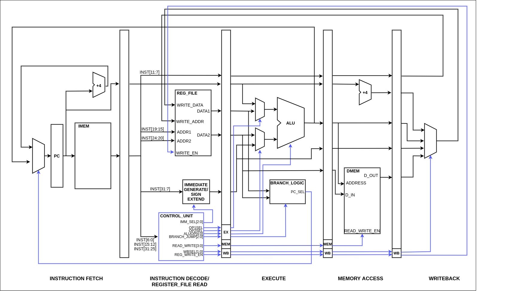

[comment]: # "This is the standard layout for the project, but you can clean this and use your own template"

# RV32IM Pipeline Implementation

---

This is a sample image, to show how to add images to your page. To learn more options, please refer [this](https://projects.ce.pdn.ac.lk/docs/faq/how-to-add-an-image/)

---

## Table of Contents

1. [Introduction](#introduction)
2. [Pipeline Datapath](#pipeline-datapath)
3. [Team](#team)
4. [Supervisors](#supervisors)
5. [Links](#links)

---

## Introduction

description of the real world problem and solution, impact

---

## Pipeline Datapath

---

## Team

- E/16/069, Damsy De Silve, [email](mailto:e16069@eng.pdn.ac.lk)
- E/16/094, Shirly Ekanayake, [email](mailto:e16094@eng.pdn.ac.lk)
- E/16/276, Buddhi Perera, [email](mailto:e16276@eng.pdn.ac.lk)

---

## Supervisors

- Dr. Isuru Navinna
- Dr. Mahanama Wickramasinghe

---

## Links

- [Project Repository](https://github.com/cepdnaclk/e16-co502-RV32IM-pipeline-implementation-group1)
- [Project Page](https://cepdnaclk.github.io/e16-co502-RV32IM-pipeline-implementation-group1/)
- [Department of Computer Engineering](http://www.ce.pdn.ac.lk/)
- [University of Peradeniya](https://eng.pdn.ac.lk/)

[//]: # "Please refer this to learn more about Markdown syntax"
[//]: # "https://github.com/adam-p/markdown-here/wiki/Markdown-Cheatsheet"
