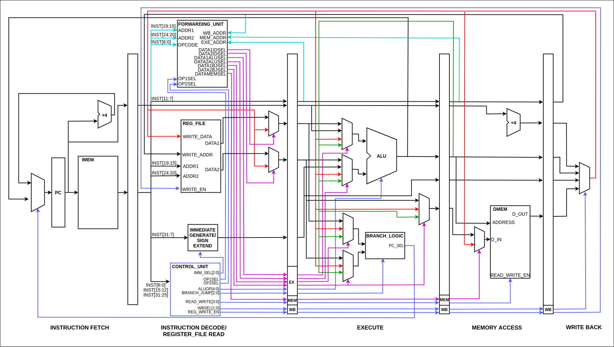

# RV32IM Pipeline Implementation

---

## Table of Contents

1. [Introduction](#introduction)
2. [Pipeline Datapath](#pipeline-datapath)
3. [Team](#team)
4. [Supervisors](#supervisors)
5. [Links](#links)

---

## Introduction

The objective of this project was to design and implement a 5 stage pipeline CPU to support the RISC-V instruction architecture. This pipeline CPU supports the entire RV32IM ISA which contains 45 instuctions.

The designed pipeline CPU was implemented using behavioural modeling in verilogHDL and icarus Verilog was used compile and simulate. gtkWave was used to observe the behaviour.

[GitHub Repository](https://github.com/cepdnaclk/e16-co502-RV32IM-pipeline-implementation-group1)

---

## Pipeline Datapath

---

## Team

- E/16/069, Damsy De Silve, [email](mailto:e16069@eng.pdn.ac.lk)
- E/16/094, Shirly Ekanayake, [email](mailto:e16094@eng.pdn.ac.lk)
- E/16/276, Buddhi Perera, [email](mailto:e16276@eng.pdn.ac.lk)

---

## Supervisors

- Dr. Isuru Navinna
- Dr. Mahanama Wickramasinghe

---

## Links

- [Project Repository](https://github.com/cepdnaclk/e16-co502-RV32IM-pipeline-implementation-group1)
- [Project Page](https://cepdnaclk.github.io/e16-co502-RV32IM-pipeline-implementation-group1/)
- [Department of Computer Engineering](http://www.ce.pdn.ac.lk/)
- [University of Peradeniya](https://eng.pdn.ac.lk/)

[//]: # "Please refer this to learn more about Markdown syntax"
[//]: # "https://github.com/adam-p/markdown-here/wiki/Markdown-Cheatsheet"
